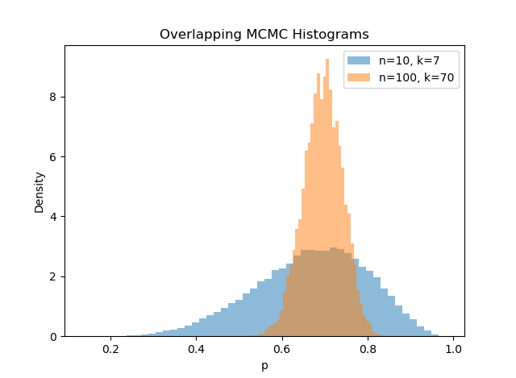

## Bayes Law

Bayesian statistics is an interpretation that involves changing your view of the world considering new information, and formalises this with Bayes' Law. This section will both go through some standard interview questions, and some non-standard questions that will hopefully help to develop intuition as to what the Bayesian process actually is.

Bayes' Law states that:

$$
P(A \mid B) = \frac{P(B \mid A)P(A)}{P(B)}
$$

First, a derivation:

$$
P(A \cup B) = P(A \mid B)P(B) = P(B \mid A)P(A)
$$
, from where we can rearrange.

In Bayes' Law, $P(A)$ is called the **prior probability**, $P(B \mid A)$ is the **likelihood** (of observing the result given our A), and $P(A \mid B)$ is the **posterior**. $P(B)$ can be thought of us a normalising constant that ensure that $\int_{A} P(A\mid B) dA = 1$. Further than specific uses of Bayes' Law, this discussion around updating priors given information to create posteriors is part of trader discourse.

---

### 1. A Rare Disease: 

#### Question:

A disease affects 1% of the population. A diagnostic test for the disease has:

- a **99% sensitivity** (probability of testing positive given that one has the disease), and  
- a **5% false positive rate** (i.e. it incorrectly identifies 5% of healthy individuals as having the disease).

Suppose a randomly selected individual takes the test and receives a **positive result**.

**What is the probability that the individual actually has the disease?**

#### Answer:

Consider $A$ the probability of someone havng the disease (prior to testing), and $B$ the probability of someone testing positive. We want to find $P(A \mid B)$

Information from the question:

- $P(A) = 0.01$
- $P(B \mid A) = 0.99$
- $P(B \mid \bar{A}) = 0.05$

Can use the law of total probability to find $P(B)$. The law of total probability (general case) states that if $\{A_1, A_2, \dots, A_n\}$ is a partition of the sample space (i.e. mutually exclusive and exhaustive events), then for any event $B$,

$$
P(B) = \sum_{i=1}^{n} P(B \mid A_i)\,P(A_i).
$$

Applied to this problem, 

$$
P(B) = P(B\mid A)P(A) + P(B \mid \bar{A})P(\bar{A})
$$

$$
P(B) = 0.99(0.01) + 0.05(0.99) = 0.0594
$$

Noiw, Bayes' Law can be applied to solve this problem.

$$
P(A \mid B) = \frac{P(B \mid A)P(A)}{P(B)}
$$

$$
= \frac{0.99 * 0.01}{0.0594} = \frac{1}{6}
$$

Note this can also be understood via odds. As the product $P(B \mid A)P(A)$ was a fifth of $P(B \mid \bar{A})P(\bar{A})$, the result observed is 5 times as likely to come from an inaccurate test result which gives $\frac{5}{6} \text{ vs } \frac{1}{6}$ as the respective probabilities.

---

### 2. Six-Seven of Clubs:

You may recognise this from your interviews.

#### Question:

You have two decks, a fully shuffled deck and a new deck (Goes Ace to King, Ace to King, Ace to King, Ace to King). I pick one at random with 50\% probability and give it to you. You cut it at a random point, and flip over the top two cards which are the 6 of clubs and the 7 of clubs. What is the probability that the next card is the 8 of clubs?

#### Answer:

First, you find what deck it is using Bayes' Law and it then becomes trivial.

This problem is identical if any two consecutive cards are drawn, so define the following events:

- $A$ is drawing two consecutive cards
- $B$ is having the new unshuffled deck

, with the following information known:

- $P(B) = P(\bar{B})= 0.5$
- $P(A\mid B) = 1$
- $P(A\mid \bar{B}) = \frac{1}{51}$

Like before can use the Law of Total Probability to give $P(A)$. 

$$
P(A) = P(A\mid B)P(B) + P(A \mid \bar{B})P(\bar{B})
$$

$$
P(A) = 1(0.5) + \frac{1}{51}(0.5) = \frac{26}{51}
$$

Bayes' Law can now be applied:

$$
P(B\mid A) = \frac{P(A \mid B)P(B)}{P(A)}
$$

$$
P(B\mid A) = \frac{1(0.5)}{\frac{26}{51}}
$$

$$
P(B\mid A) = \frac{51}{52}
$$

Given this, can now find the probability of getting the 8 of clubs next. if we have the shuffled deck, it is $\frac{1}{50}$, and if we have the unshuffled deck it is 1.

$$
P(\text{8 of Clubs Next}) = 1  \frac{51}{52} + \frac{1}{50} \frac{1}{52}
$$

$$
P(\text{8 of Clubs Next}) = \frac{2551}{2600}
$$

### 3. Computer Selling:

#### Question:

Company A supplies 40% of the computers sold and is late 5% of the time. Company B supplies 30% of the computers sold and is late 3% of the time. Company C supplies another 30% and is late 2.5% of the time. A computer arrives late - what is the probability that it came from Company A? 

#### Answer:

Let event L denote the computer arriving late.

$$
P(L) = \sum_{S_i \in \text{suppliers}} P(S_i) P(L \mid S_i)
$$

$$
P(L) = 0.4(0.05) + 0.3(0.03) + 0.3(0.025) = 0.0365
$$

$$
P(A \mid L) = \frac{P(L \mid A)P(A)}{P(L)}
$$

$$
P(A \mid L) = \frac{0.05(0.4)}{0.0365} = 0.55
$$

### 4. Coin Game:

#### Question:

You pick a random biased coin with $P(H) \sim U(0, 1)$, flip it 10 times and get 7 heads. Make a centered 95% confidence interval on $P(H)$. What if you flip it 100 times and get 70 heads.

#### Answer:

The intuition here is that the CI for the 10 flips should be skewed more towards $P(H) = 0.5$ than the 100 flips because you're updating less towards the observed value; the difference in likelihood between 7 of 10 heads with $P(H) = 0.5$ vs $P(H) = 0.7$ is much less than the difference in likelihood between 70 of 100 heads with $P(H) = 0.5$ vs $P(H) = 0.7$. Additionally, the CI should be much tighter for the 100 flip trial. This should be sufficient in practice if you get this question, but I will also plot the distribution of $P(H \mid \text{Observed result})$ for both results. You need to use something called MCMC here which you are not expected to know in the least, but is required to actually get the final answer.

, with the below results:

| Metric                   | Trial 1 (10 flips) | Trial 2 (100 flips) |
|--------------------------|-------------------:|--------------------:|
| Mean                     | 0.6681             | 0.6955              |
| Median                   | 0.6778             | 0.6971              |
| 95% Confidence Interval  | (0.4347, 0.8657)   | (0.6182, 0.7678)    |